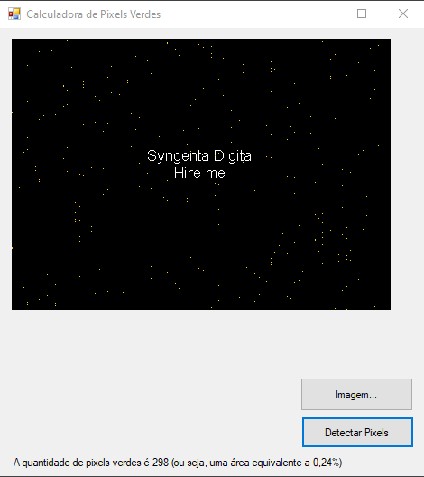

# Desafio Syngenta Digital 🏆

-   Tratamento de imagem fazendo contagem da quantidade de Pixels Verdes presentes na imagem 
-   Ao capturar pixels verdes na imagem os marca c/ 🔆(Dourado) na PictureBox, contabiliza a quantidade de pixels e imprime o número de pixels e % da área correspondente.

## Pre requisitos para rodar o projeto  ❗

-   Visual Studio 2019, Visual Studio Code
-   .NET Framework 4.7

## Tecnologias Implementadas  ⚙

-   NET Framework 4.7
-   Windows Forms

# Preview

